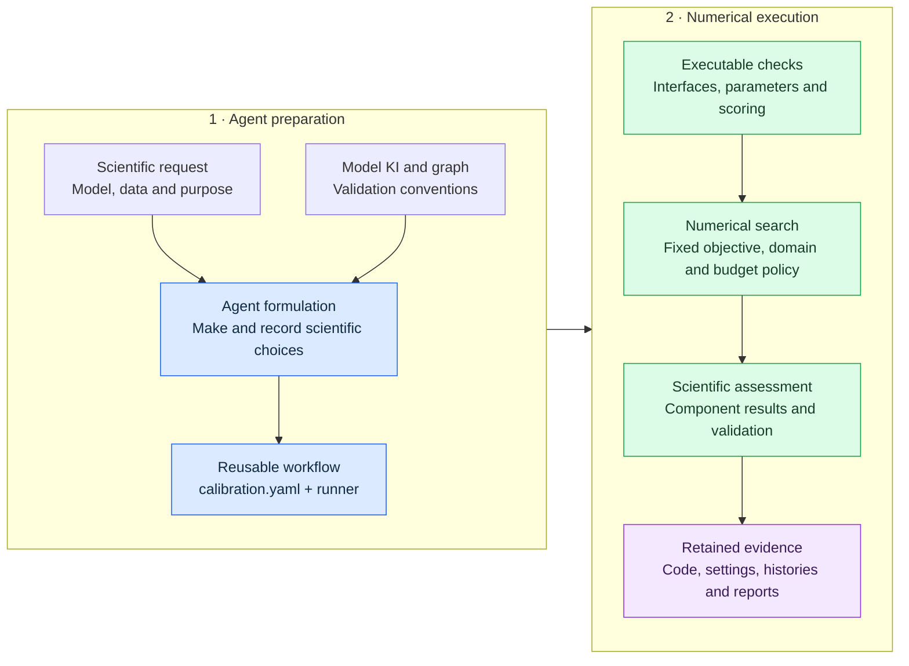
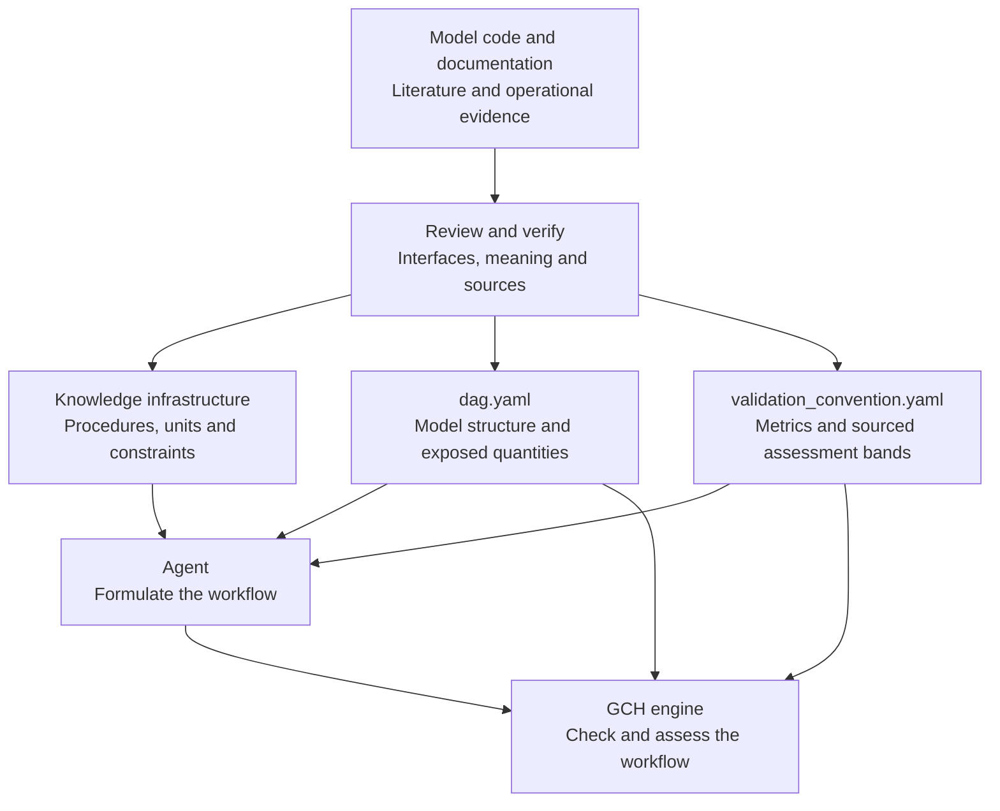
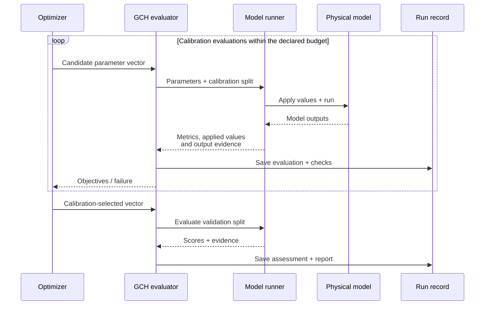
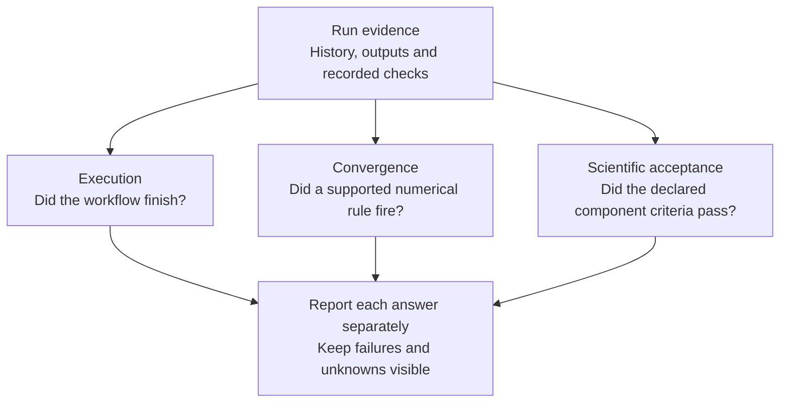
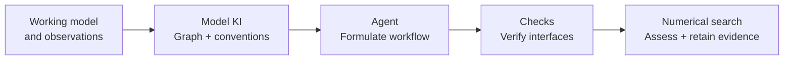

# GCH — General Calibration Harness

**Let agents formulate calibration workflows. Let numerical software execute, check and preserve them.**

Calibrating a process-based model requires more than finding a parameter vector. Someone must identify meaningful parameters, connect simulated quantities to observations, handle units and time scales, choose objectives and an optimizer, and decide what counts as a useful result.

GCH delegates this formulation to language-model agents, guided by model-specific **knowledge infrastructure (KI)** and explicit validation conventions. The agent produces reusable workflow code and a calibration specification. Numerical search then proceeds without further agent judgments. The aim is adaptable calibration with scientific competence, consistency and reproducibility; the experiments below test distinct parts of that claim.

**Start here:** [run the example](#run-a-small-example) · [understand the workflow](#how-the-workflow-works) · [see the evidence](#what-the-study-found) · [add a model](#bring-a-new-model) · [inspect the paper archive](#inspect-or-reproduce-the-study)

## How the workflow works

The key design choice is **where the agent works**: before the numerical search. Its flexibility helps translate a scientific request and unfamiliar model interfaces into an executable workflow. Once that workflow is checked and fixed, established numerical algorithms perform the repeated evaluations.



**GCH names the whole approach.** The directory `calibration_kit/` implements its numerical engine; it is not a second framework. This checkout includes that engine, a complete synthetic example and a provider-independent [agent preparation guide](docs/AUTHORING.md). Connect your chosen agent through that guide; a turnkey language-model launcher and the original KI host application are not included.

### Knowledge provides the scientific context

KI records what a model can actually do and how to use it. It draws on source code, documentation, calibration literature and checked operational knowledge. In the study, the model graph was synthesized and verified before the calibration task. This preparation gives the agent usable scientific context and gives the engine declarations against which to check the resulting workflow.



| Scientific choice | What the knowledge and workflow must make explicit |
| --- | --- |
| Parameter domain | Meaning, units, defaults, admissible ranges, transformations and constraints |
| Observation mapping | Exposed model quantity, units, spatial/temporal aggregation, warm-up and scoring periods |
| Objective | Suitable metrics, direction of improvement, weights or multiple-objective trade-offs |
| Optimizer and budget | Algorithm compatibility, seed count, fixed cap or time allowance, and rationale |
| Assessment | Component-level criteria, comparison with defaults and the validation procedure |
| Executable environment | Model binary, interpreter, libraries, input data and file-handling requirements |

The graph is `dag.yaml` at the KI root; assessment conventions are in `docs/validation_convention.yaml` inside that KI. An unsupported or unsourced assessment band should remain unspecified. A graph alone cannot establish that an observation mapping or parameter bound is scientifically correct.

### What happens during numerical search?

The runner is the bridge to the physical model. For each candidate, it applies the proposed parameters, runs the model and returns the requested scores together with evidence about the values and outputs used.



A failed commissioning check requires correcting or rejecting the workflow before search. The ordinary search loop makes **no language-model calls**. The current engine selects using calibration and then assesses validation. The historical six-family multivariable experiment used validation-informed selection; its results must be read with that distinction in mind.

## Why the workflow is robust—and what the checks establish

Robustness comes from inspectable choices, executable checks and preserved evidence. It does not mean that every generated workflow is correct or that every completed search produces an acceptable scientific result.

| Layer | Mechanism | Code or guide |
| --- | --- | --- |
| Declared problem | Explicit targets, parameter domains, metrics and model graph constrain the formulation. | [Contract schema](calibration_kit/CALIBRATION_YAML_SCHEMA.md), [objectives](calibration_kit/objectives.py) |
| Executable interface | Commissioning checks a default run, required metrics and requested scoring split before a full search. | [Orchestration](calibration_kit/calib.py), [runner](calibration_kit/runner.py) |
| Parameter use | Applied-value read-back and output perturbation checks help detect parameters that were ignored, misapplied or had no demonstrated effect. | [Evaluator](calibration_kit/evaluator.py) |
| Affordable computation | Pilot timing supports measured budget allocation; fixed caps retain an explicit declared limit. | [Pilot](calibration_kit/pilot.py), [budget](calibration_kit/budget.py) |
| Numerical behavior | Optimizer-specific convergence evidence is recorded separately from budget exhaustion. | [Native rules](calibration_kit/native_rules.py), [usage](USAGE.md#budgets-and-convergence) |
| Scientific assessment | Individual variables and metrics are checked, including validation and default comparisons where specified. | [Assessment conventions](calibration_kit/stop.py), [holdout](calibration_kit/holdout.py) |
| Repeatability | Explicit seeds, evaluation histories, retained workflow files and environment identities support rerunning and reassessment. | [Seeds](calibration_kit/seeds.py), [replay](calibration_kit/replay.py), [version guide](docs/REPRODUCIBILITY.md) |



The agent chooses the budget policy during formulation. GCH can estimate a feasible cap from a time allowance, but affordability is not convergence. For example, DDS has no native convergence rule here: reaching its cap can leave convergence **unknown**, even if the selected result passes scientific assessment.

Checks also have limits. Raw-output proofs and applied values come from the runner, so its implementation still matters. Missing evidence can produce an **UNPROVEN** status rather than halt every run. Two known parameter-consumption edge cases and a macOS resource-planning limitation are documented in [testing notes](docs/TESTING.md). The mechanism makes these limits inspectable; it does not certify arbitrary generated code.

## What the study found

The study tests three capabilities separately. These are results from the archived study toolkit and environments, not a fresh benchmark of the current engine. [Detailed results](docs/RESULTS.md) provide test IDs, metrics, protocols and archive locators.

| Capability | Experiment | Main finding |
| --- | --- | --- |
| **Adaptive generality** | WOFOST, HBV, SUMMA, VIC, MODFLOW 6 and CRHM; initial single-objective and multivariable formulations | All six initial specifications executed unchanged: three searched and passed validation; three stopped because defaults met the declared target. All six multivariable searches completed; **16 of 23** variable–metric components passed joint acceptance. |
| **Scientific competence** | FSM2 with structured KI, raw documentation or model name only; five generations per condition | First-pass execution was **5/5, 3/5 and 0/5**, respectively. KI validation NSE was **0.81–0.94**, versus **0.57** for defaults. Prespecified target/unit repairs exposed concrete causes of failure. |
| **Consistency and reproducibility** | Five GR4J formulations × three seeds, plus six objective interventions; eleven archived numerical replay packages | The **15** common-objective endpoints spanned **9.22 × 10⁻⁴ NSE**. All eleven replay packages reproduced their comparison metrics in a **single parameter-vector evaluation per package**. |

The interpretation matters. The six-family multivariable results include unsuccessful components and validation-informed selection. FSM2 information conditions differed in content as well as organization. GR4J consistency was conditional on the objective; eleven single evaluations are not eleven complete campaign reruns.

A useful example is **WOFOST biomass**: validation NRMSE of **25.8%** met the absolute 30% ceiling but was worse than the **21.1%** default, so it failed joint acceptance. GCH preserves that distinction instead of treating a finished optimization as scientific success.

### Why move agent decisions before the search?

Earlier studies demonstrate several useful roles for agents. GCH asks whether the scientific formulation can be delegated while subsequent numerical search runs independently.

| Study | Role of the agent | Relationship to GCH |
| --- | --- | --- |
| [Zhu et al., 2026, GRL](https://doi.org/10.1029/2025GL120043) | LLMs interpret VIC simulation diagnostics and repeatedly propose parameter updates during calibration. | GCH fixes the formulation before a numerical optimizer searches it. |
| [HydroAgent, Li et al., 2026, preprint v1](https://arxiv.org/abs/2605.17792v1) | A calibration policy is trained on teacher-generated calibration trajectories and online CREST simulation feedback. | GCH examines knowledge-guided workflow formulation followed by established optimizers. |
| [Yan et al., 2026, GRL](https://doi.org/10.1029/2025GL119814) | A prototype agent coordinates natural-language hydrologic tasks, including data retrieval, execution, diagnostics and reports, with human oversight. | GCH concentrates on the calibration specification, executable runner and assessment evidence. |

These are architectural comparisons. Different models, datasets and protocols do not support a cross-paper performance ranking.

**Our matched VIC experiment** compared fixed DDS with a continuing agent proposer over ten paired blocks. Both arms shared the formulation, six parameters, an NSE objective, five starting vectors and **150 calibration evaluations** per block.

| Validation outcome | Result |
| --- | ---: |
| Fixed DDS median NSE | 0.8724 |
| Continuing-agent median NSE | 0.8755 |
| Median paired difference, fixed minus agent | −0.0030 |
| 95% bootstrap interval for the paired difference | [−0.0074, 0.0023] |
| Prespecified non-inferiority margin | −0.0200 |

The interval satisfied the prespecified margin. For this formulation and budget, fixed numerical search retained validation skill with **zero optimization-stage agent calls**. The continuing arm was a compact proposer using MADR diagnostics and frozen search guidance, not a reproduction of the full published MADR system. Ten interrupted agent attempts were excluded under the recorded infrastructure-failure rules. See the [paired experiment details](docs/RESULTS.md#matched-fixed-search-versus-continuing-agent-proposals).

### How close were the conventional calibration references?

These checks concern established numerical references, separately from agent comparisons:

- **GR4J / airGR:** generated and reference workflows both reached calibration NSE of approximately **0.799**, using 1,000 and 234 evaluations, respectively.
- **SAC-SMA / CAMELS:** generated validation NSE was **0.699 versus 0.626** for the reference; KGE was **0.688 versus 0.696**, and volume bias was **+24.82% versus −0.53%**. Different model/PET configurations and supplied parameter bounds limit equivalence claims.

The SAC-SMA case supports useful fit, with an important bias limitation; it does not establish complete reproduction of the published configuration or superiority across metrics. [Reference details and source records](docs/RESULTS.md#reference-checks) retain those distinctions.

## Run a small example

Use Python 3.12 in a virtual environment:

```bash
python3.12 -m venv .venv
source .venv/bin/activate
python -m pip install -r requirements.txt
python examples/minimal/run.py --output ./outputs/minimal
```

The [example](examples/minimal/README.md) calibrates two parameters of a synthetic linear reservoir with DDS, 60 search evaluations and seed 7. It includes its data, graph, contract and subprocess runner, with separate calibration and holdout periods. It needs no agent account or external simulator.

Open `outputs/minimal/report.json` and `outputs/minimal/run/eval_history.jsonl` to follow the recorded choices, evaluations and assessment. This demonstrates execution of an already prepared workflow; it does not generate a new workflow or reproduce a paper experiment. Use a fresh output directory for another run.

## Bring a new model

The reusable pattern is the same; the scientific interface is model-specific.



1. Make a default simulation work in a recorded environment, with accessible observations.
2. Prepare the KI: model interfaces, scientifically defensible domains, observation mappings, model graph and sourced assessment conventions.
3. Give the agent the scientific request and these resources. Have it record its choices in `calibration.yaml` and implement the runner interface.
4. Check the default run, units, parameter application and scoring splits before committing to a search.
5. Retain the final workflow, KI/data/runtime identities, engine commit, seeds, reports and histories.

This design is extensible to other process-based models with suitable executable interfaces and scientific knowledge. The evidence covers six model families; creating a KI alone does not establish success for every model. Follow the [preparation guide](docs/AUTHORING.md) and [engine interface](USAGE.md) for implementation.

## Inspect or reproduce the study

```bash
python paper/reproduce.py list
python paper/reproduce.py list --test E4_VIC_PAIRED
python paper/reproduce.py validate --paper-root /path/to/study-package
python paper/reproduce.py check-saved --paper-root /path/to/study-package
```

The [paper guide](paper/README.md) maps tests to contracts, KIs, data, environments and results. The companion study package is supplied separately; a clone does not contain its model binaries, observations or full histories. These commands inspect metadata and saved evidence, rather than launching physical-model or agent campaigns.

Use each experiment's recorded engine and environment for numerical reproduction. The exact sealed GR4J runtime and nine additional cross-provider contracts remain unavailable; the indexes preserve those limitations. See [versions and reproduction scope](docs/REPRODUCIBILITY.md).

## Code map and development

| Location | Purpose |
| --- | --- |
| [`calibration_kit/`](calibration_kit/) | Numerical engine, optimizer adapters, executable checks and implementation tests |
| [`docs/AUTHORING.md`](docs/AUTHORING.md) | Agent inputs, scientific decisions and executable handoff |
| [`USAGE.md`](USAGE.md) | Engine interface, budgets, convergence and saved-history reassessment |
| [`examples/minimal/`](examples/minimal/) | Complete synthetic integration example |
| [`docs/RESULTS.md`](docs/RESULTS.md) | Study evidence, numerical results and exact archive locators |
| [`paper/`](paper/) | Reported-test indexes and portable companion-package checks |
| [`examples/paper_tests/`](examples/paper_tests/) | Research scripts and convergence-validation records requiring their original inputs |

```bash
python -m pip install -r requirements-dev.txt
python -m pytest -q
```

[Testing notes](docs/TESTING.md) separate portable software checks, optional integrations and known limitations. Software tests do not substitute for scientific validation of scoring, stopping or selection changes. Former host-specific `authoring/` adapters remain in Git history at `5722f2b`; the [preparation guide](docs/AUTHORING.md) is the supported entry point here.
